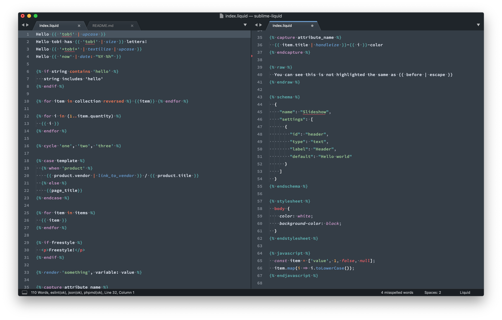

# Liquid Sublime

> A collection of syntaxes and completions for Liquid (and Shopify) templates

### Why?

*How is this different from [braver/sublime-liquid](https://github.com/braver/sublime-liquid)?*

- Better highlighting, overall
- More completions
- Line and block comments
- Highlights `` (as JS), `` (as SCSS), `` (as JSON), and `` (as "nothing")
- Proper scoping for snippets (no liquid completions showing up in other files)

### Usage

*With Git*

- `cd $HOME/Library/Application\ Support/Sublime\ Text\ 3/Packages`
- `git clone https://github.com/james2doyle/sublime-liquid`

*With Package Control*

- "Package Control > Add Repository"
- https://github.com/james2doyle/sublime-liquid
- "Package Control > Install Package"
- Install "sublime-liquid" package

### TODOs

- [x] comments
- [x] tag completions
- [x] filter completions
- [x] javascript, stylesheet, schema, raw highlighting
- [ ] publish on Package Control
